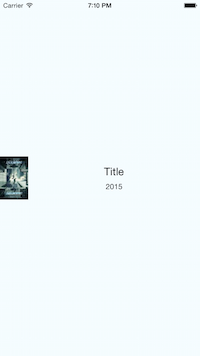
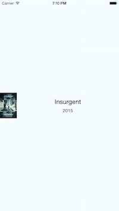

---

title: react-native

meta:
  - name: description
    content: React-Native
  - name: keywords
    content: js，react，react-native, RN

created: 2020/05/10

updated: 2020/05/10
 
tags:
  - js
  - react
  - react-native
  - RN
 
---

# RN教程

> [React-Native-Guide ( gitHub指南 )](https://github.com/reactnativecn/react-native-guide)


## 安装

React Native 需要一些在 [`开始 React Native`](http://reactnative.dev/docs/getting-started.html#content) 中阐明的基本的安装。

在完成了这些依赖项的安装之后，这里有两条可以为一个 React Native 项目完全准备好的命令。

```cmd
npm install -g react-native-cli
```

react-native-cli 是完成剩余安装的命令行工具。它是通过 npm 安装的。这将会在你的终端里面安装 `react-native` 这个命令行，你只需要做一次即可。

```cmd
react-native init AwesomeProject
```

这一条命令获取 React Native 的源代码和依赖包，然后在 ` AwesomeProject/iOS/AwesomeProject.xcodeproj ` 创建一个新的 Xcode 项目，并且在` AwesomeProject/android/app `下面创建一个 gradle 项目。


## 开发

在 iOS 端，现在你可以在` Xcode `里面打开这个新项目` (AwesomeProject/AwesomeProject.xcodeproj)`，然后使用` ⌘+R `来简单的构建和运行这个项目。这样做也会开启允许代码实时渲染的 Node 服务器。有了它你可以通过在模拟器里面按住` ⌘+R `来看你的更改，而不用在 Xcode 里面重新编译。

在 Android 端，在` AwesomeProject `里面运行` react-native run-android `来在你的模拟器设备上面安装生成的应用，并且开启允许代码实时渲染的 Node 服务器。为了看到你的更改你必须打开震动菜单（摇动你的设备或者按住设备上面的菜单按钮，在模拟器上面按住 F2 或者 Page Up，在 Genymotion 上面按住` ⌘+M `），然后点击 Reload JS。

在这篇教程里面我们会开发一个简单版本的电影应用，该应用可以获取电影院里面的 25 部电影，并且将它们显示在 ListView 里面。


## Hello World

` react-native init `将会生成和你的工程名字一样的应用，在这个例子中就是` AwesomeProject `。这是一个简单的 hello world 应用。在 iOS 上面你可以编辑` index.ios.js ` 来给这个应用做一些改变，然后在模拟器里面按住` ⌘+R `来看发生的改变。在 Android 上面可以编辑` index.android.js `来给你的应用做一些改变，并且按住震动菜单上面的 Reload JS 来看发生的改变。


## 伪造数据

在我们书写代码来获取真正的 Rotten Tomatoes 数据之前，我们可以伪造一些数据开始使用 React Native。在 Facebook 我们经常会在 JS 文件的头部申明常量，就在 requires 下面，但是你想增加什么数据就增加什么数据。在` index.ios.js `或者` index.android.js `里面：

```js
var MOCKED_MOVIES_DATA = [
  {title: 'Title', year: '2015', posters: {thumbnail: 'http://i.imgur.com/UePbdph.jpg'}},
];
```

## 渲染一部电影

我们将要给这部电影渲染标题，年份，缩略图。因为缩略图在 React Native 里面是一个图片组件，在下面的 React requires 里面增加 Image。

```js
var {
  AppRegistry,
  Image,
  StyleSheet,
  Text,
  View,
} = React;
```

现在我们改变这个渲染函数，因此我们可以渲染上面提到的数据，而不是 hello world。

```js
  render: function() {
    var movie = MOCKED_MOVIES_DATA[0];
    return (
      <View style={styles.container}>
        <Text>{movie.title}</Text>
        <Text>{movie.year}</Text>
        <Image source={{uri: movie.posters.thumbnail}} />
      </View>
    );
  }
```

按住` ⌘+R `/` Reload JS `然后你就会看到在 "2015" 上面的 "Title" 。注意 Image 并不会渲染任何东西。这是因为我们没有给我们想要渲染的图片增加宽度和高度。这将会由样式来完成。让我们在改变样式的时候我们可以清除一些我们不再使用的样式。

```js
var styles = StyleSheet.create({
  container: {
    flex: 1,
    justifyContent: 'center',
    alignItems: 'center',
    backgroundColor: '#F5FCFF',
  },
  thumbnail: {
    width: 53,
    height: 81,
  },
});
```

最后我们需要将这个样式应用到这个图片组件上面：

```html
  <Image
    source={{uri: movie.posters.thumbnail}}
    style={styles.thumbnail}
  />
```

按住` ⌘+R `/` Reload JS `现在这个图片就会渲染了。


## 增加一些样式

太棒了，我们已经渲染了我们的数据。现在让我们让它看起来更美观一点。我将会将文字放在图片的右边，并且让标题更大，然后在区域里面居中。

```
+---------------------------------+
|+-------++----------------------+|
||       ||        Title         ||
|| Image ||                      ||
||       ||        Year          ||
|+-------++----------------------+|
+---------------------------------+
```

我们需要增加另外一个容器来垂直的展开在水平方向上面展开的组件。

```js
  return (
    <View style={styles.container}>
      <Image
        source={{uri: movie.posters.thumbnail}}
        style={styles.thumbnail}
      />
      <View style={styles.rightContainer}>
        <Text style={styles.title}>{movie.title}</Text>
        <Text style={styles.year}>{movie.year}</Text>
      </View>
    </View>
  );
```

没有改变很多，我们在文本外面增加了一个容器，然后将它们移动到图片后面（因为它们在图片右边）。现在让我们看看样式都改变了什么：

```js
  container: {
    flex: 1,
    flexDirection: 'row',
    justifyContent: 'center',
    alignItems: 'center',
    backgroundColor: '#F5FCFF',
  },
```

我们使用 FlexBox 来布局－可以看看 [这篇文章](https://css-tricks.com/snippets/css/a-guide-to-flexbox/) 来了解更多。

在上面的代码片段里面，我们简单的增加了` flexDirection: 'row' `，这将会让在主容器里面的孩子节点水平的展开而不是垂直展开。

现在我们给这个 JS 的 style 对象增加另外一个样式：

```css
  rightContainer: {
    flex: 1,
  },
```

这意味着这个` rightContainer `在没有被图片占据的父容器里面占据了剩余的空间。如果这不起作用的话，给` rightContainer `增加一个` backgroundColor `并且尝试着移除` flex: 1 `。你将会看到这将会导致父容器的大小将会变为能够容纳孩子视图的最小大小。

给文本加上样式就很直接了：

```css
  title: {
    fontSize: 20,
    marginBottom: 8,
    textAlign: 'center',
  },
  year: {
    textAlign: 'center',
  },
```

然后按住` ⌘+R `/` Reload JS `你就会看到更新后的视图了。



## 获取真实数据

从 Rotten Tomatoes 的 API获取数据并不和学习 React Native 有任何关系，因此继续学习下去吧。

在这个文件的顶部增加下面的一些常量（通常在 requires 下面）来创建获取数据的 REQUEST_URL。

```js
/**
 * For quota reasons we replaced the Rotten Tomatoes' API with a sample data of
 * their very own API that lives in React Native's Github repo.
 */
var REQUEST_URL = 'https://raw.githubusercontent.com/facebook/react-native/master/docs/MoviesExample.json';
```

给我们的应用增加一些初始化的状态，因此我们可以检查` this.state.movies === null `来看电影数据是否被加载。当带有` this.setState({movies: moviesData}) `响应返回的时候我们可以设置数据。就在我们的 React 类里面的渲染函数上面增加这段代码：

```js
  getInitialState: function() {
    return {
      movies: null,
    };
  },
```

我们想在组件完成加载的时候关闭请求。 在组件被加载之后，` componentDidMount `是 React 组件里面只会调用一次的函数。

```js
  componentDidMount: function() {
    this.fetchData();
  },
```

现在给我们的主组件增加上面是用到的` fetchData `。这个方法将会负责处理数据的获取。你需要做的就是在解决预期的问题之后调用` this.setState({movies: data}) `函数。因为 React 的工作方式是：` setState `会触发一个从新渲染，之后渲染函数就会注意到` this.state.movies `不再为 null 。注意我们在最后调用` done() `－请总是确保调用` done() `否则任何抛出的错误信息都会被隐藏。

```js
  fetchData: function() {
    fetch(REQUEST_URL)
      .then((response) => response.json())
      .then((responseData) => {
        this.setState({
          movies: responseData.movies,
        });
      })
      .done();
  },
```

现在修改这个渲染函数来渲染一个加载的视图，如果我们没有任何电影数据，否则选择第一部电影。

```js
  render: function() {
    if (!this.state.movies) {
      return this.renderLoadingView();
    }

    var movie = this.state.movies[0];
    return this.renderMovie(movie);
  },

  renderLoadingView: function() {
    return (
      <View style={styles.container}>
        <Text>
          Loading movies...
        </Text>
      </View>
    );
  },

  renderMovie: function(movie) {
    return (
      <View style={styles.container}>
        <Image
          source={{uri: movie.posters.thumbnail}}
          style={styles.thumbnail}
        />
        <View style={styles.rightContainer}>
          <Text style={styles.title}>{movie.title}</Text>
          <Text style={styles.year}>{movie.year}</Text>
        </View>
      </View>
    );
  },
```

现在按住` ⌘+R `/` Reload JS `然后直到响应返回的时候你会看到 "Loading movies..." ，之后它就会渲染从 Rotten Tomatoes 获取到的第一部电影。



## ListView

现在让我们来修改这个应用来在一个` ListView `组件里面渲染所有的数据，而不是只是渲染第一部电影。

为什么一个` ListView `比只渲染所有的元素或者将它们放到一个` ScrollView `要好一些？尽管 React 很快，但是渲染一个不确定列表的元素可能就会慢。` ListView `渲染视图，因此你只在屏幕上显示要显示的视图，那些已经渲染过但是不在屏幕上显示的就会被从原生视图层移除。

第一件事就是快：在这个文件顶部增加` ListView `必须项。

```js
var {
  AppRegistry,
  Image,
  ListView,
  StyleSheet,
  Text,
  View,
} = React;
```

现在修改渲染函数，因此一旦我们获取到了数据，它就会渲染一个列表的电影而不只是一部电影。


```js  
  render: function() {
    if (!this.state.loaded) {
      return this.renderLoadingView();
    }

    return (
      <ListView
        dataSource={this.state.dataSource}
        renderRow={this.renderMovie}
        style={styles.listView}
      />
    );
  },
```

这个` DataSource `是一个被` ListView `用来决定在更新的过程中哪一行被改变了的接口。

你会注意到我们从` this.state `来使用` dataSource `。下一步就是给由` getInitialState `返回的对象增加一个空的` dataSource `。既然我们在` dataSource `里面存放数据，我们不应该在此使用` this.state.movies `来保存数据两次。我们可以使用状态` (this.state.loaded) `的布尔属性来判断获取数据是否完成。

```js
  getInitialState: function() {
    return {
      dataSource: new ListView.DataSource({
        rowHasChanged: (row1, row2) => row1 !== row2,
      }),
      loaded: false,
    };
  },
```

这里是更具状态更新的修改之后的` fetchData `：

```js
  fetchData: function() {
    fetch(REQUEST_URL)
      .then((response) => response.json())
      .then((responseData) => {
        this.setState({
          dataSource: this.state.dataSource.cloneWithRows(responseData.movies),
          loaded: true,
        });
      })
      .done();
  },
```

最后我们给` ListView `组件的 styles JS 对象增加样式：

```css
  listView: {
    paddingTop: 20,
    backgroundColor: '#F5FCFF',
  },
```

现在这是最终结果：


这里仍然有一些工作要做来让它称为一个功能完全的应用，比如：增加导航栏，搜索框，下拉刷新加载等。在[` Movies Example `](https://github.com/facebook/react-native/tree/master/Examples/Movies) 来看全部的功能。

## 最终源代码


```js
/**
 * Sample React Native App
 * https://github.com/facebook/react-native
 */
'use strict';

var React = require('react-native');
var {
  AppRegistry,
  Image,
  ListView,
  StyleSheet,
  Text,
  View,
} = React;

var API_KEY = '7waqfqbprs7pajbz28mqf6vz';
var API_URL = 'http://api.rottentomatoes.com/api/public/v1.0/lists/movies/in_theaters.json';
var PAGE_SIZE = 25;
var PARAMS = '?apikey=' + API_KEY + '&page_limit=' + PAGE_SIZE;
var REQUEST_URL = API_URL + PARAMS;

var AwesomeProject = React.createClass({
  getInitialState: function() {
    return {
      dataSource: new ListView.DataSource({
        rowHasChanged: (row1, row2) => row1 !== row2,
      }),
      loaded: false,
    };
  },

  componentDidMount: function() {
    this.fetchData();
  },

  fetchData: function() {
    fetch(REQUEST_URL)
      .then((response) => response.json())
      .then((responseData) => {
        this.setState({
          dataSource: this.state.dataSource.cloneWithRows(responseData.movies),
          loaded: true,
        });
      })
      .done();
  },

  render: function() {
    if (!this.state.loaded) {
      return this.renderLoadingView();
    }

    return (
      <ListView
        dataSource={this.state.dataSource}
        renderRow={this.renderMovie}
        style={styles.listView}
      />
    );
  },

  renderLoadingView: function() {
    return (
      <View style={styles.container}>
        <Text>
          Loading movies...
        </Text>
      </View>
    );
  },

  renderMovie: function(movie) {
    return (
      <View style={styles.container}>
        <Image
          source={{uri: movie.posters.thumbnail}}
          style={styles.thumbnail}
        />
        <View style={styles.rightContainer}>
          <Text style={styles.title}>{movie.title}</Text>
          <Text style={styles.year}>{movie.year}</Text>
        </View>
      </View>
    );
  },
});

var styles = StyleSheet.create({
  container: {
    flex: 1,
    flexDirection: 'row',
    justifyContent: 'center',
    alignItems: 'center',
    backgroundColor: '#F5FCFF',
  },
  rightContainer: {
    flex: 1,
  },
  title: {
    fontSize: 20,
    marginBottom: 8,
    textAlign: 'center',
  },
  year: {
    textAlign: 'center',
  },
  thumbnail: {
    width: 53,
    height: 81,
  },
  listView: {
    paddingTop: 20,
    backgroundColor: '#F5FCFF',
  },
});

AppRegistry.registerComponent('AwesomeProject', () => AwesomeProject);
```