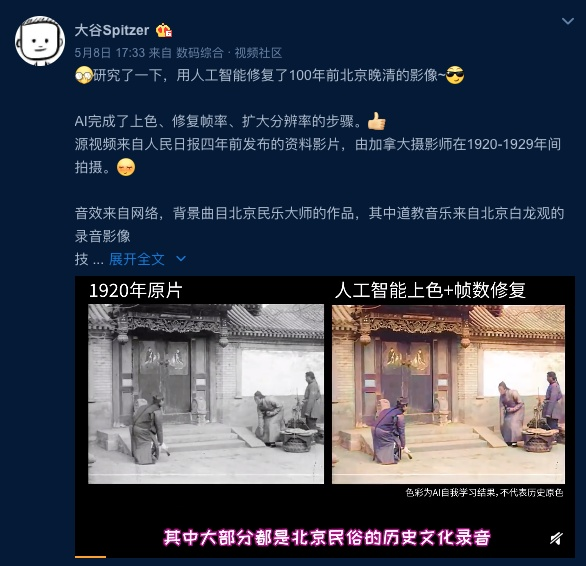
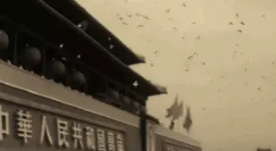
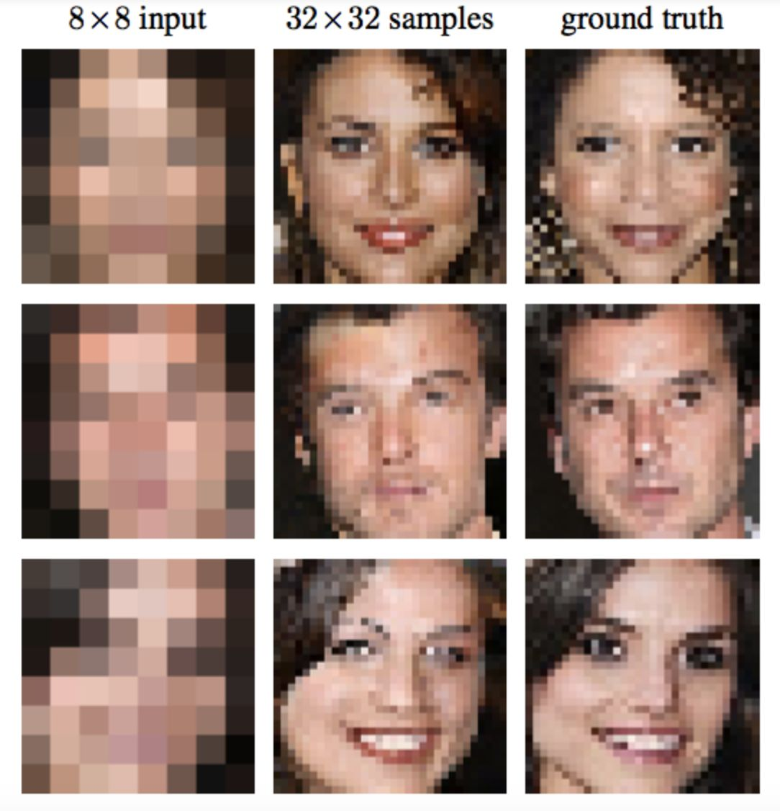
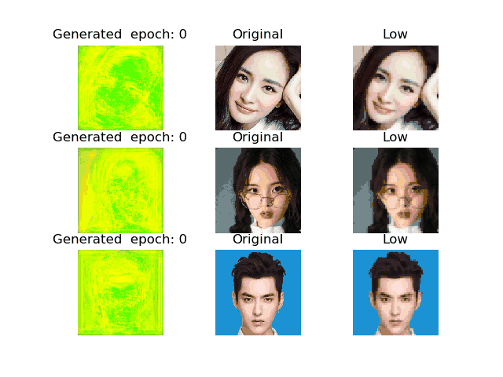
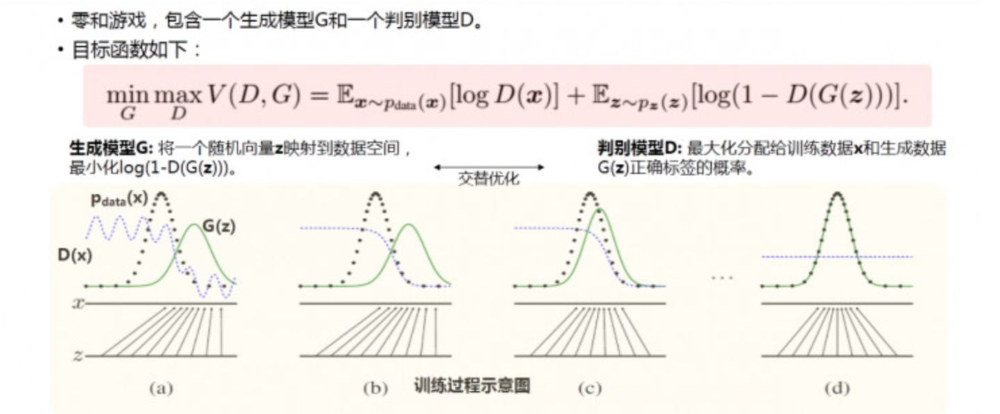
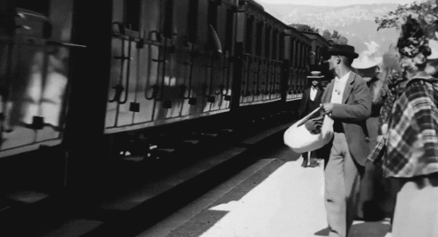
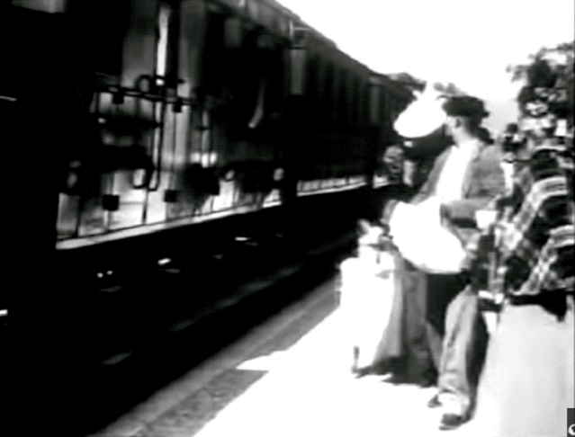
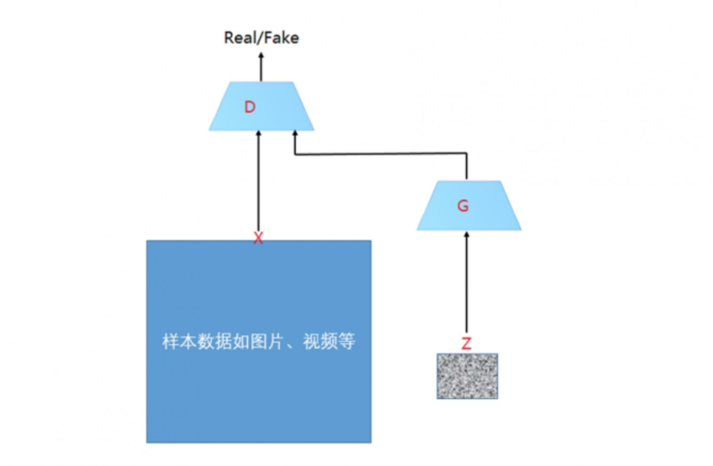
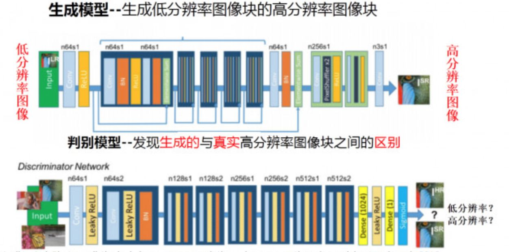
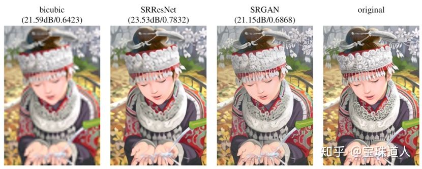

---

title: AI人工智能

meta:
  - name: description
    content: 如何评价人工智能修复的 100 年前北京影像，有哪些意义和可以应用的方向？
  - name: keywords
    content: AI技术, 人工智能

created: 2020/05/11

updated: 2020/05/12
 
tags:
  - AI技术
  - 人工智能
  - 影像
 
---

# 如何评价人工智能修复的 100 年前北京影像，有哪些意义和可以应用的方向？

> @大谷Spitzer 研究了一下，用人工智能修复了 100 年前北京晚清的影像
---------

## 大谷Spitzer 博文

  

---------

## 100 年前北京晚清的影像

  <video src="./images/AImeloch1.mp4" controls/>

---------

> 评论

---------

看这部100年前的影像，真是被震撼到。100年前的人，如今斗转星移，物似人非。不禁感叹人生如梦幻泡影，如梦亦如电

近几年，AI在视频的数字化修复方面成果还是挺显著的。像《红楼梦》《三国演义》《开国大典》和《红岩》这些经典的老电影，因为年代久远，在今天的影视播放工具上放映时，清晰度太低，有时根本没法看

怎么办呢？

过去，如果要复原经典的老电影，得要技师手工逐帧修复、合成，用非常传统方式来进行图像处理，需要耗费大量的物力和时间，旧影片的修复工作也进展得很缓慢（一部时长2h的影片的修复，可能就要一个十几人的修复师团队连续工作20天左右）

而利用AI对人像和场景进行修复，效率就完全不同了。AI技术可以先通过机器学习和模型训练来填充细节提高老电影的画质，再利用深层神经网络为老电影“上色”，最后进行转录和人脸识别，从而完成对整部影片的修复，这个过程大概只需要12个小时左右。

---------

> AI助力《开国大典》修复重映

  

## 一、“超清”是如何产生的？

在100年前北京影像的介绍中，提到一个词：“帧数修复”。

那么，照片“高糊”和“超清”是如何产生的呢？

我们现在在网上看到的照片，大多都是由相机、扫描仪等设备捕捉画面生成的数字图像。因为照片对色彩丰富程度的要求很高，所以通常会以位图的形式进行储存和传播。

这类图片显示的基本单位就是我们通常所说的像素，每个像素都有对应的颜色值。这种显示方式可以使图像看上去更加还原、逼真。

将原图放大后看到的一个个“马赛克”就是组成图像的像素。

因此，一张图像含有的像素数量的多少直接决定了图像的精细程度，也就是我们常说的分辨率，分辨率越高，图像中显示的像素越多，画面也更加清晰。

  

老的影像作品，受到当时冲印技术的限制，加之在保存过程中会有褪色、霉变和磨损等一系列问题，导致照片中的高光或暗部细节消失，扫描成数字图像时又会产生一部分的损失，多种原因造成了我们在网上看到的老照片清晰度不够。

AI对图像的处理和修复，主要包括人像特征补全和黑白照片上色。

这项功能是如何得到实现的呢？传统图像修复的技术基础是扩散方法，利用这种方法构建缺失部位的像素时，会尽量保持重建部分和周围像素点的一致性，利用待修补区域的边缘信息对缺失的像素进行估测。

    

不过，如果遇到图像待补全的缺失部分很大的情况，传统的方法就会失效，此时就需要AI发挥自己合理的“想象力”来对照片进行补全了。比如，100年前北京影像补帧使用的是 DAIN，分辨率倍增部分使用了 ESRGAN，上色应用了 DeOldify，此外用 VirtualDub 做了一些老电影降噪处理。

-----

## 二、AI是如何修复旧片的？

那么，AI又是如何获得这份“想象力”的呢？这还要归功于它强大的学习能力。

基于生成对抗网络（GAN）的深度学习（DL）算法已经证明了计算机视觉任务在图像恢复方面的巨大潜力。GAN现在受到工业界广泛的关注。

有许多做人工智能研究的公司正在投入大量的精力来发展和推广GAN模型

> GAN算法原理
>
> 以生成图片为例进行说明：
>
> 假设有两个网络，分别为G（Generator）和D（Discriminator），它们的功能分别是：
>
> 1）G是一个生成图片的网络，它接收一个随机的噪声z，通过这个噪声生成图片，记做G（z）。
>
> 2）D是一个判别网络，判别一张图片是不是“真实的”。它的输入参数是x，x代表一张图片，输出D（x）代表x为真实图片的概率，如果为1，就代表100％是真实的图片，而输出为0，就代表不可能是真实的图片。
>
> 3）在最理想的状态下，G可以生成足以“以假乱真”的图片G（z）。对于D来说，它难以判定G生成的图片究竟是不是真实的，因此D（G（z）） ＝ 0．5。
>
> 4）这样目的就达成了：得到了一个生成式的模型G，它可以用来生成图片。

在训练过程中，生成网络G的目标就是尽量生成真实的图片去欺骗判别网络D。而判别网络D的目标就是尽量把G生成的图片和真实的图片分别开来。这样，G和D构成了一个动态的“博弈过程”。

  

GAN的应用范围较广，扩展性也强，可应用于图像生成、数据增强和图像处理等领域。

国外网友Denis Shiryaev还曾利用一种增强程序(Gigapixel AI)，将1896年的古董电影《火车进站》，转变成了4K 60fps高清“大电影”。

   

什么？你说没太大感觉？

好吧，下面是原片：

   

原始《火车进站》的效果，低清、卡顿，还有大量的噪点。

这位网友采用的是一种叫做 Gigapixel AI 的商业图像编辑软件(付费)。这款软件由Topaz实验室创造，可以让图像的质量提升600%

> 如果用足球运动来进行比喻GAN的原理：在GAN框架中，将生成模型G比喻球员的“假摔”，他们的目标是使用各种手段迷惑裁判，使得自己进攻或者防守战术动作是合规的。
>
> 比如球门前的假摔看上去像真的对方犯规一样，判别模型则相当于裁判，他们目标是将球员各种混杂在合规战术里的违规动作找出来。
> 
> 在球员和裁判的不断对抗中，球员的“假摔”水平越来越高，裁判识别“假摔”水平也越来越高。随着两方水平的不断提高，最终谁都无法区分出哪个动作是真正的“假摔”，也就是AI的水平已经实现以假乱真

简单地说，首先，我们可以向程序中输入大量的低分辨率图像。

然后再输入这些图像的高分辨率原始照片，算法会通过对两者进行比较，寻找其中的差异，并通过不断地对照、修复，来对图片进行纠错。

最终获得精确增加图像分辨率的技巧。

生成模型要将模糊的低分辨率图像作为输入，并输出一个高分辨率的清晰图像。而判别模型，就要判断所输入的图像究竟是“真实高分辨率图像”还是由低分辨率图像“转化来的高分辨率图像”。而这就大大简化了图像超分辨率模型的学习过程。因为传统上做一个图像超分辨率，都要去对一些高频细节进行建模，而这里生成模型训练目的就简化为迷惑判别模型。

   

像人类一样，AI在掌握了这门技巧之后，不需要原始照片对照也能准确地修复、重建低分辨率图像。

把黑白旧照片变成彩色照片也不是一项简单的工作，同样需要AI事先对大量含有常见场景和人物的图片进行学习和记忆。

在“上色”前，AI会首先对照片进行图像分割，区分出标志性物体，比如人脸、衣服、建筑物和天空等，再结合这些事物通常所对应的色彩信息，将黑白照片里的内容进行彩色化。

其实，AI修复照片的原理其实类似于训练一段程序，让它对质量很差的图像进行“脑补”，但并不是说完全能100%恢复图像原来的样子。如同GAN的缺点之一——它的可解释性非常差，因为我们最后所学到的一个数据分布Pg(G)，没有显示的表达式。它只是一个黑盒子一样的映射函数：输入是一个随机变量，输出是我们想要的一个数据分布。

-----

## 参考

> 1. [AI优化生活：人工智能——GAN算法](https://www.ofweek.com/ai/2018-06/ART-201721-8300-30241840.html)
>
> 2. [量子位：百年古董电影秒变4K高清、60FPS，AI插值，还能着色](https://zhuanlan.zhihu.com/p/105861700)
>
> 3. [电脑爱好者：AI自画像背后的功臣——详解GAN](http://m.cfan.com.cn/article/129518)

修复效果不错，配音选择上也很用心。首先为这个工作点赞！

作者在微博中提到了：用AI完成了上色、帧率修复、扩大分辨率的步骤。这些步骤底层蕴含的技术应该都是生成对抗网络（GAN），其中第一项用的应该是某种图像风格转换技术，第三项用的是某种图像超分辨率技术。第二项猜测也是某种类似于超分辨率的技术，区别在于第三项是空间超分辨率以提升生成图像的大小，第二项是时序“超分辨率”以提升视频帧率。说某种是因为相关的技术已经比较多了，单纯从视觉效果上看，反推不出具体方法。

基于GAN的图像内容生成是个蛮有意思的话题，今天班门弄斧稍微多说一点，当然都是基于看视频的反推，说得不对还请大家批评指正。

在没有深度学习的时代，图像上色、分辨率提升的工作也都存在。以分辨率提升为例，有很多基于插值的方法，比如线性插值、双线性插值、双三次插值，这些都是利用一个固定公式，基于两边的像素直接计算出插值的值。虽然效果也还行，但通过下图可以看到（图取自CVPR 2017论文：Photo-Realistic Single Image Super-Resolution Using a Generative Adversarial Network，也就是著名的SRGAN模型），图像宽高4倍上采样后，双三次插值方法相比于基于GAN的方法，效果有明显差距。

   

为什么GAN这么神奇呢？它通过利用深度模型、大量训练数据和对抗博弈学习机制，有效捕获了输入输出数据对中蕴含的复杂映射关系，生成了高度逼真的视觉内容。当（生成器的）输入输出是低分辨率和高分辨率图像时，此时的任务是图像超分辨率。当训练数据及任务不同时，这套建模机制也可以用来做不同的事情，AI换脸、老照片上色都属于这个范畴。

> 具体到本帖的例子，扩大分辨率用的应该就是SRGAN以及基于此改进的模型。这方面的技术这几年发展很快，比如，去年优酷就举行了阿里巴巴优酷视频增强和超分辨率挑战赛，吸引各路豪强打擂台。

[https://tianchi.aliyun.com](https://tianchi.aliyun.com/competition/entrance/231711/introduction?spm=5176.12281949.1003.2.3bad4c2a66zWdz)

> AI上色这块，输入和输出可以是老照片和人工修复的老照片。这些照片成对最好，修复效果相对更好，但即使不成对也没关系，现在的模型也能hold住。当然这个过程可以分解得更加细致，以生成更好的上色效果，CVPR2020上就有这方面的工作，链接如下：

[https://blog.csdn.net/moxibingdao/article/details/105804030](https://blog.csdn.net/moxibingdao/article/details/105804030)

> 百度公司也开放了让黑白老照片变彩色的百度“焕彩”工具，效果也还不错，大家感兴趣也可以试试，介绍链接如下：

[https://baijiahao.baidu.com/s?id=1619791103818828253&wfr=spider&for=pc](https://baijiahao.baidu.com/s?id=1619791103818828253&wfr=spider&for=pc)

> 现在也有一些软件和APP提供了历史照片修复功能，此处就不展开叙述了。回到本帖，作者的上色严格来说还有改进空间，特别是若有更加合适的预训练模型的话。
>
> 此外，现在也有一个”马栏山”杯国际音视频算法大赛（湖南芒果TV组织），其中有一个赛道就是画质优化，和这里的上色多少有一定相似之处。提一句，这个竞赛的奖金还是蛮高的，大家不介意交出知识产权的话（获奖的话知识产权都归主办方了），可以去试试。

[https://link.zhihu.com/?target=http%3A//news.yesky.com/hotnews/313/706730313.shtml](https://link.zhihu.com/?target=http%3A//news.yesky.com/hotnews/313/706730313.shtml)

## 
玩一玩

:::primaryLong

### 
源代码

[jantic/DeOldify](https://github.com/jantic/DeOldify)

### 
在线demo

[Image Colorization API](https://deepai.org/machine-learning-model/colorizer)
:::

