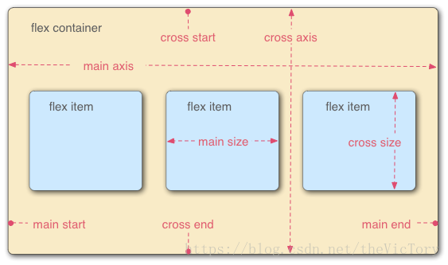
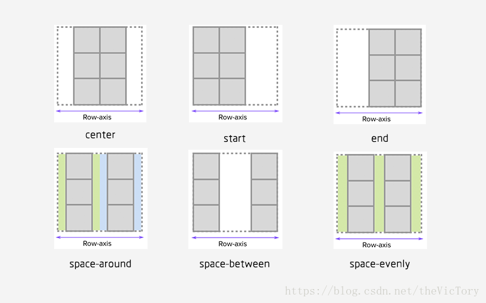

---

title:  flex布局

meta:
  - name: description
    content:  flex布局简单教程
  - name: keywords
    content:  flex布局

created: 2020/04/17

updated: 2020/04/17
 
tags:
  - flex
  - 使用教程

---

# ReactNative学习--FlexBox布局

## 1、什么是FlexBox

> FlexBox是FlexibleBox的简称，它是一种CSS3的布局模式，用于灵活排列容器内的元素。它能够自动伸缩容器内的元素，使它们在不同的屏幕尺寸与设备上合适地展现出来，它在以下方面有较好的表现：
- 在不同方向排列元素
- 重新排列元素的显示顺序
- 更改元素的对齐方式
- 将元素动态装入容器

## 2、基本概念

> 如图所示为一个橙色父容器，里面横向排列了三个子元素：



- 主轴（main axis）：子元素排列的方向。该轴的开始和结束被称为 main start 和 main end。
- 交叉轴（cross axis）：是垂直于 flex 元素放置方向的轴。该轴的开始和结束被称为 cross start 和 cross end。例如上图横向排列，主轴为横- 向，交叉轴为纵向。
- flex 容器（flex container）：包含子容器的外部父容器。
- flex 项（flex item）：内部被包含的子元素。

## 3、设置方向与换行

    1、使用FlexBox首先需要将父容器的CSS样式设置为flex分布：

```css
display:flex;
```

    2、对父容器设置主轴方向，默认值为纵向column：

```css
flex-direction: row;            //设置为横向
```

可以设置值为row-reverse/column-reverse来使元素反向排列

    3、换行，默认情况下， flex 项不允许多行/列排列，如果 flex 容器尺寸对于所有 flex 项来说不够大，那么flex 项将被调整大小以适应单行或列排列。这样将会压缩每个子容器，可以设置开启换行将溢出的子元素放到下一行：

```css
flex-wrap:wrap;
```

可以将主轴方向与换行合并为一个属性：

```css
flex-flow: row wrap;
```

## 4、对齐方式
>  通过justify-content属性来设置元素位于主轴上的对齐方式，align-items来设置交叉轴的。对齐方式有以下六种：



- center : flex项居中对齐。
- flex-start: flex项靠轴起始端对齐。
- flex-end : flex项靠轴的结束端对齐。例如主轴横向，设置主轴对齐方式为end，则元素靠右对齐

```css
display:flex;
flex-direction:row;
justify-content:end;    //主轴末尾对齐
```

- space-around : 每个 flex 项的两侧间距都是相等的。
- space-between : 任何两个相邻 flex 项之间的间距是相同的，但是开头与末尾没有间距。
- space-evenly : 每个flex项的间距相等，包括开头结尾。注意与space-around区别：space-around两个元素之间的间距是开头、末尾间距的两倍，而space-evenly则是相等的。

> 可以通过align-self来对某个特定的flex项的交叉轴对齐方式进行设置。

## 5、flex项的动态尺寸
### 5.1、拉伸

>  通过flex-grow属性可以控制flex项在flex容器中的拉伸比例，当容器有剩余空间时，flex项会进行拉伸以充满容器，flex-grow指定该 flex 项相对于其他 flex 项将拉伸多少。默认值为1，设为0则不会进行拉伸

```css
.flex-item1{flex-grow: 0;}
.flex-item2{flex-grow: 1;}
.flex-item3{flex-grow: 2;}
```

flex的拉伸是相对与其他设置flex-grow的项而言的，例如容器内有三个子元素，item1设为0不拉伸，item2设为1，item3设为2，则当有剩余空间时，有两个子元素拉伸，item2拉伸三分之一，item3拉伸三分之二以充满容器。

###  5.2、收缩

> flex-shrink只有在 flex 容器空间不足时才会生效。它指定 flex 项相对于其他 flex 项将缩小多少，以使 flex 项不会溢出 flex 容器。 默认值为 1。当设置为0时，该 flex 项将不会被收缩。

### 5.3、设置大小

> 如果希望像普通CSS一样自定义元素的大小，则需要通过flex-basis来指定，其值可以px、%等为单位。

```css
flex-basis:20%;
```

可以将以上三个属性合并为flex-item，按顺序为flex-grow、flex-shrink、flex-basis，当flex容器有剩余空间时进行flex-grow拉伸，容器空间不足时执行flex-shrink收缩

```css

.flex-item {
  flex: 1 0 100px;
}
```


